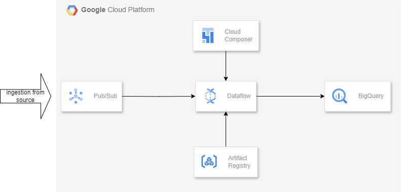

# Food Orders Streaming Data Pipeline
This is the streaming data pipeline that runs continuously to fetch data from pubsub and do transformations and write to bigquery tables.



## Google Cloud Services Used

### PubSub
The data will get published to PubSub topic continuously

Here, pubsub_publisher.py is publishing messages to PubSub topic after reading data from csv files

### Bigquery
Transformed data will be stored in bigquery under two tables: 'delivered_orders' and 'other_orders'

```
bq --location us-central1 mk <DATASET_NAME>
```

### Composer
Composer will run dag which will start the flex template to run until stopped manually

```
gcloud composer environments create <ENVIRONMENT_NAME> \
    --location us-central1 \
    --image-version composer-3-airflow-2.7.3-build.7
```

### Artifact Registry
To create dataflow flex template, we need to store the respective docker image at this repository

```
gcloud artifacts repositories create <REPO_NAME> \
 --repository-format=docker \
 --location=us-central1
```

### Dataflow
Dataflow pipeline does the following:
1. Reads the data from PubSub
2. Does data cleansing
3. Seperate data on the basis of order status
4. Write data to bigquery table

#### Run dataflow job to check if the job runs fine
```
python streaming_pipeline.py \
    --region us-central1 \
    --runner DataflowRunner \
    --project <PROJECT_ID> \
    --temp_location gs://<BUCKET>/tmp/ \
    --topic projects/<PROJECT_ID>/topics/<TOPIC_NAME> \
    --dataset <DATASET>
```

#### Build Dataflow Flex Template

```
gcloud dataflow flex-template build gs://<BUCKET>/streaming_pipeline.json \
 --image-gcr-path "us-central1-docker.pkg.dev-<PROJECT_ID>/foodorders/streamingpipeline:latest" \
 --sdk-language "PYTHON" \
 --flex-template-base-image "PYTHON3" \
 --metadata-file "metadata.json" \
 --py-path "." \
 --env "FLEX_TEMPLATE_PYTHON_PY_FILE=streaming_pipeline.py" \
 --env "FLEX_TEMPLATE_PYTHON_REQUIREMENTS_FILE=requirements.txt"
```

#### Run Flex Template
```
gcloud dataflow flex-template run streamingfoodorders \
--template-file-gcs-location gs://<BUCKET>/streaming_pipeline.json \
--region us-central1 \
--parameters topic=projects/<PROJECT_ID>/topics/<TOPIC_NAME>,dataset=<DATASET>
```

## Orchestrate from Composer
Upload 'dag.py' to Composer DAGs bucket
